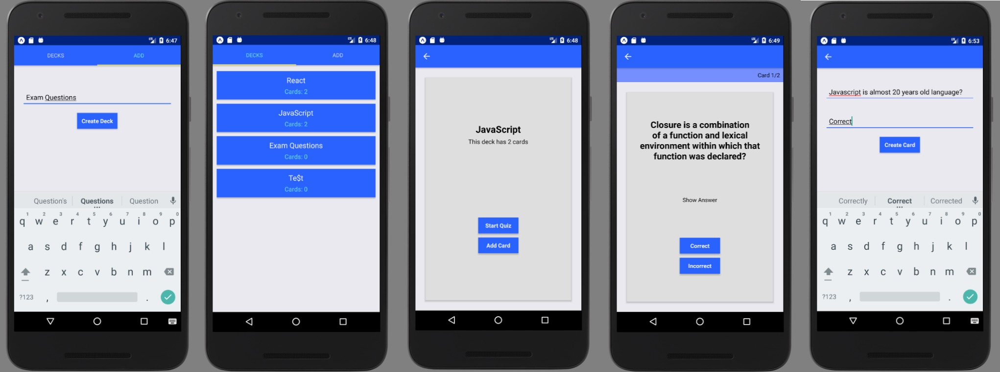

# Mobile-Flashcards
React Nanodegree final project - mobile flashcards app using React Native

### Project Description

Using React Native, I have build an Android application that allows users to study collections of flashcards. The app will allow users to create different categories of flashcards called "decks", add flashcards to those decks, then take quizzes on those decks. The application is tested on LG Spirit 4G LTE.  

### Running the application

This application is build using a tool by [Expo](https://expo.io/) called 'create-react-native-app', so you will only need NodeJS and NPM (or Yarn) to start it. If you want to run the application on your Android device, download the Expo app from the Google Play Store and scan the QR code which is displayed in the command like window after running `yarn start`.

`$ yarn install`

`$ yarn start`